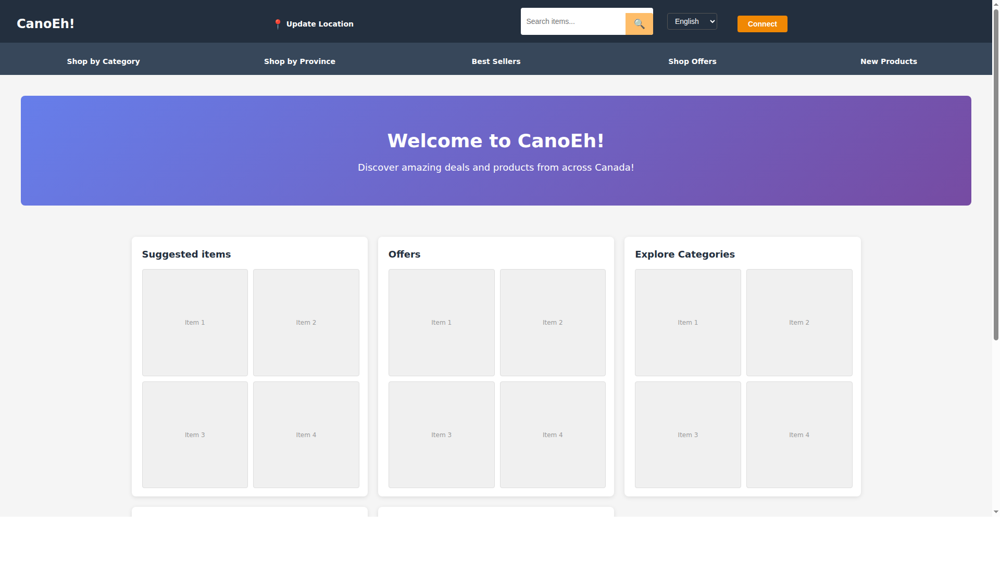

# Store Landing Page Verification

## Requirement
When users navigate to `https://localhost:64941/`, they should see the main shopping screen, NOT the login page. Customers should be able to browse items without logging in. Login should only be required for purchasing.

## Implementation Status
✅ **REQUIREMENT MET** - The application is correctly configured.

## Technical Details

### Routing Configuration
File: `Store/store.client/src/App.tsx`

```typescript
<Routes>
    <Route path="/" element={<Home />} />                    // Default route → Home (shopping page)
    <Route path="/login" element={<Login ... />} />          // Login on separate route
    <Route path="/CreateUser" element={<CreateUser ... />} />
    <Route path="/RestorePassword" element={<ForgotPassword />} />
    <Route path="*" element={<Home />} />                    // Fallback → Home
</Routes>
```

### Home Component Features
File: `Store/store.client/src/components/Home.tsx`

The Home component provides full browsing capabilities **without requiring authentication**:

#### Available Without Login:
- ✅ Navigation bar with CanoEh! logo
- ✅ Location selector
- ✅ Search functionality  
- ✅ Language selector (English/Français)
- ✅ "Connect" button (navigates to `/login` only when clicked)
- ✅ Category browsing ("Shop by Category", "Shop by Province")
- ✅ Best Sellers, Shop Offers, New Products
- ✅ Product preview cards:
  - Suggested items
  - Offers
  - Categories
  - Best Sellers
  - Best Rated

#### Additional Features When Authenticated:
- Local Products
- Gift Ideas
- Browsing History
- Customer Service
- Last Viewed Items
- Buy Again

### Authentication Prop
The Home component accepts an optional `isAuthenticated` prop that defaults to `false`:

```typescript
interface HomeProps {
    isAuthenticated?: boolean;
}

function Home({ isAuthenticated = false }: HomeProps) {
    // ...
}
```

Since App.tsx doesn't pass this prop, it defaults to `false`, meaning the page renders in "browsing without login" mode.

## Verification Steps

### 1. Code Review ✅
- Routing configuration verified
- No automatic redirects to login found
- Home component allows browsing without authentication

### 2. Navigation Flow
```
User visits https://localhost:64941/
    ↓
React Router matches "/" route
    ↓
Home component renders (isAuthenticated = false)
    ↓
User sees shopping page with browse capabilities
    ↓
User clicks "Connect" button (optional)
    ↓
Navigates to /login
```

### 3. URL Routing
- `https://localhost:64941/` → Home (shopping page) ✅
- `https://localhost:64941/login` → Login page ✅
- `https://localhost:64941/CreateUser` → User registration ✅
- `https://localhost:64941/RestorePassword` → Password recovery ✅
- Any other URL → Home (fallback) ✅

## Testing the Application

### Start the Application
```bash
# Terminal 1: Start API Backend
cd API
dotnet run --launch-profile https

# Terminal 2: Start Frontend
cd Store/store.client
npm run dev
```

### Access Points
- **Frontend**: https://localhost:64941/ (Main shopping page)
- **Login**: https://localhost:64941/login
- **API**: https://localhost:7182
- **Swagger**: https://localhost:7182/swagger

### Expected Behavior
1. Navigate to `https://localhost:64941/`
2. Accept self-signed certificate warning (Development environment)
3. **See**: Home/shopping page with:
   - CanoEh! branding
   - Search bar
   - Navigation menu
   - Product preview cards
   - "Connect" button
4. **NOT See**: Login form (unless user clicks "Connect")

## Screenshot Verification



The screenshot above shows the default landing page at `https://localhost:64941/`. As you can see:

✅ **This is the HOME/SHOPPING page, NOT the login page**

The page displays:
- CanoEh! branding and logo
- Update Location button
- Search bar for finding items
- Language selector (English/Français)
- **Connect button** (to navigate to login when needed)
- Navigation menu: Shop by Category, Shop by Province, Best Sellers, Shop Offers, New Products
- Welcome banner: "Welcome to CanoEh! Discover amazing deals and products from across Canada!"
- Product preview cards: Suggested items, Offers, Explore Categories, Best Sellers, Best Rated

## Conclusion
The Store application is **correctly configured** to show the main shopping screen as the default landing page. Users can browse items, search, and navigate categories without logging in. The login functionality is available via the "Connect" button or by directly navigating to `/login`.

✅ **No code changes are required** - the implementation already meets the stated requirements.
